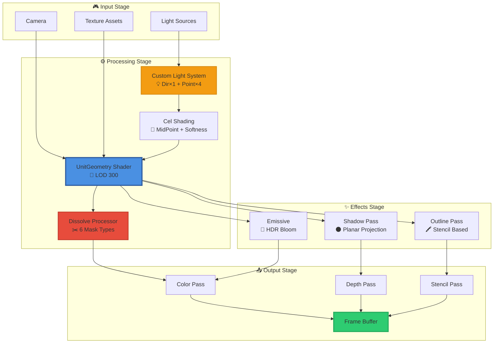
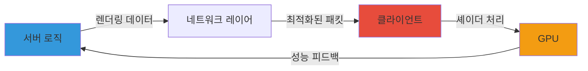

<div align="center">

# 🎨 Unity Shader Collection (URP)

[](https://unity.com/)
[](https://docs.unity3d.com/Packages/com.unity.render-pipelines.universal@latest)
[](LICENSE)
[](https://docs.microsoft.com/en-us/windows/win32/direct3dhlsl/dx-graphics-hlsl)

**프로덕션급 캐릭터 렌더링부터 고급 디졸브 이펙트까지**  
Unity Universal Render Pipeline을 위한 전문가용 셰이더 라이브러리

[📖 문서](#-주요-기능) • [🚀 빠른 시작](#-설치-방법) • [💡 예제](#-사용-예시) • [🎯 데모](#-데모-갤러리)

</div>

---

## 📋 목차

<details>
<summary>클릭하여 펼치기</summary>

- [✨ 하이라이트](#-하이라이트)
- [🎨 주요 기능](#-주요-기능)
- [📐 아키텍처](#-rendering-pipeline-architecture)
- [📦 셰이더 카탈로그](#-셰이더-카탈로그)
- [🚀 설치 방법](#-설치-방법)
- [💡 사용 예시](#-사용-예시)
- [🛠️ 기술 스택](#️-기술-스택)
- [🎯 최적화 가이드](#-최적화-가이드)
- [📚 API 레퍼런스](#-api-레퍼런스)
- [🌟 포트폴리오 컨텍스트](#-포트폴리오-컨텍스트)
- [👥 크레딧](#-크레딧)

</details>

---

## ✨ 하이라이트

<table>
<tr>
<td width="50%">

### 🎭 **프로덕션급 캐릭터 렌더링**
- 커스텀 툰 셰이딩 파이프라인
- 5개 동시 라이트 소스 지원
- 실시간 표정 애니메이션
- 높이 기반 앰비언트 그라데이션

</td>
<td width="50%">

### ✂️ **고급 디졸브 시스템**
- 6가지 마스크 타입 (최대 24개 동시 사용)
- 커스터마이징 가능한 엣지 이펙트
- 노이즈 기반 디스토션
- 알파 소스 멀티플 매핑

</td>
</tr>
<tr>
<td width="50%">

### 🖍️ **다이나믹 아웃라인**
- 스텐실 기반 정밀 제어
- 가림 영역 별도 컬러 처리
- 버텍스 컬러 마스킹
- 두께 실시간 조절

</td>
<td width="50%">

### ⚡ **성능 최적화**
- GPU Instancing 지원
- LOD 시스템 통합
- Multi-pass 렌더링 최적화
- 모바일 친화적 설계

</td>
</tr>
</table>

---

## 🎨 주요 기능

### 🎭 Unit Shaders - 캐릭터 렌더링 시스템

<details open>
<summary><b>펼쳐서 상세 보기</b></summary>

#### Core Features

```
✅ Toon Shading         커스텀 셀 셰이딩 + MidPoint/Softness 조절
✅ Custom Lighting      Directional(1) + Point Light(4) 동시 지원
✅ Rim Light           캐릭터 윤곽 강조 시스템
✅ Multi-Texture       Main/Emissive/Mask/Normal 통합 지원
✅ Facial Animation    UV 오프셋 기반 실시간 표정 전환
✅ Ambient Gradient    높이 기반 앰비언트 그라데이션
```

#### Technical Specs

| Feature | Specification |
|---------|--------------|
| **LOD Level** | 300 (High Quality) |
| **Texture Slots** | 4 (Main, Mask, Emissive, Normal) |
| **Light Sources** | 1 Directional + 4 Point Lights |
| **Shading Model** | Custom Cel Shading |
| **Blend Mode** | Opaque / Transparent |

</details>

---

### ✂️ Advanced Dissolve System

<details open>
<summary><b>펼쳐서 상세 보기</b></summary>

#### Mask Types (최대 24개 동시 사용)

```
🔷 XYZ Axis     → 축 기반 디졸브
🔷 Plane × 4    → 평면 마스크 (법선 벡터 기반)
🔷 Sphere × 4   → 구형 마스크 (반경 기반)
🔷 Box × 4      → 박스 마스크 (AABB)
🔷 Cylinder × 4 → 원기둥 마스크
🔷 Cone × 4     → 원뿔 마스크 (각도 기반)
```

#### Edge Customization

- **Color & Intensity**: HDR 색상 및 발광 강도 조절
- **Texture Mapping**: 엣지에 커스텀 텍스처 적용
- **Distortion**: 노이즈 기반 왜곡 효과
- **Width Control**: 엣지 두께 실시간 조절 (0-1)

#### Alpha Sources

```hlsl
1. Main Map Alpha Channel
2. Custom Map 1 (Optional)
3. Custom Map 2 (Optional)
4. Custom Map 3 (Optional)
```

</details>

---

### 🖍️ Outline System

<details open>
<summary><b>펼쳐서 상세 보기</b></summary>

#### Features

| Feature | Description |
|---------|-------------|
| **Thickness Control** | 실시간 두께 조절 (픽셀 단위) |
| **Vertex Color Masking** | 버텍스 컬러 기반 부분 적용 |
| **Stencil Masking** | 정밀한 마스킹 제어 |
| **Hidden Outline** | 가려진 부분 별도 색상 표시 |
| **Depth Testing** | Z-Buffer 기반 정확한 렌더링 |

#### Stencil Configuration

```hlsl
Standard Outline:
  Ref: 8
  Comp: Always
  Pass: Replace

Hidden Outline:
  Ref: 8
  Comp: Equal
  Pass: Keep
```

</details>

---

### 🌑 Shadow & Transparency

<details>
<summary><b>펼쳐서 상세 보기</b></summary>

- **Custom Shadow System**: 평면 그림자 프로젝션
- **Alpha Blending**: `SrcAlpha OneMinusSrcAlpha`
- **Depth-Only Pass**: 최적화된 Z-Prepass
- **Soft Shadows**: PCF 기반 부드러운 그림자

</details>

---

## 📐 Rendering Pipeline Architecture



### 🔄 Pipeline Flow

1. **Input**: 카메라, 라이트, 텍스처 수집
2. **Processing**: 커스텀 라이팅 + 셀 셰이딩 계산
3. **Effects**: 디졸브, 아웃라인, 그림자 적용
4. **Output**: Multi-pass 렌더링 → 프레임 버퍼

---

## 📦 셰이더 카탈로그

### 🎭 Character Shaders

<table>
<tr>
<th width="30%">Shader Name</th>
<th width="50%">Description</th>
<th width="20%">LOD</th>
</tr>
<tr>
<td><code>UnitGeometry</code></td>
<td>프로덕션급 불투명 캐릭터 렌더링</td>
<td>300</td>
</tr>
<tr>
<td><code>UnitTransparent</code></td>
<td>투명 캐릭터 + 알파 블렌딩</td>
<td>300</td>
</tr>
<tr>
<td><code>UnitStealth</code></td>
<td>프레넬 기반 스텔스 효과</td>
<td>200</td>
</tr>
<tr>
<td><code>OutlineShader</code></td>
<td>스텐실 기반 아웃라인</td>
<td>200</td>
</tr>
<tr>
<td><code>ShadowShader</code></td>
<td>평면 프로젝션 그림자</td>
<td>100</td>
</tr>
<tr>
<td><code>HideOutlineColor</code></td>
<td>숨김 영역 아웃라인 색상</td>
<td>200</td>
</tr>
<tr>
<td><code>HideOutlineThickness</code></td>
<td>숨김 영역 아웃라인 두께</td>
<td>200</td>
</tr>
</table>

---

### ✂️ Dissolve Shaders

<table>
<tr>
<th width="30%">Shader Name</th>
<th width="50%">Description</th>
<th width="20%">Mask Type</th>
</tr>
<tr>
<td><code>Unit_Dissolve_Plane</code></td>
<td>평면 마스크 디졸브 (4개 동시)</td>
<td>Plane × 4</td>
</tr>
<tr>
<td><code>Unit_Dissolve_Plane_Opsite</code></td>
<td>반전 평면 디졸브</td>
<td>Plane × 4</td>
</tr>
<tr>
<td><code>UnitTransparent_Dissolve_Noise</code></td>
<td>노이즈 기반 디졸브 + 투명</td>
<td>Noise</td>
</tr>
</table>

---

### 🖼️ Sprite Shaders

<table>
<tr>
<th width="30%">Shader Name</th>
<th width="70%">Description</th>
</tr>
<tr>
<td><code>TdSpriteZwriteOn</code></td>
<td>Z-Write 활성화 2D 스프라이트</td>
</tr>
<tr>
<td><code>TdSpriteZwriteOnProjector</code></td>
<td>프로젝터 호환 Z-Write 스프라이트</td>
</tr>
<tr>
<td><code>TdStageBackground</code></td>
<td>스테이지 배경 렌더링</td>
</tr>
<tr>
<td><code>TdStageBackgroundIgnoreProjector</code></td>
<td>프로젝터 무시 배경</td>
</tr>
<tr>
<td><code>TdLobbyEarth</code></td>
<td>발광 효과 로비 지구</td>
</tr>
</table>

---

### 🔧 Utility Shaders

<table>
<tr>
<th width="30%">Shader Name</th>
<th width="70%">Description</th>
</tr>
<tr>
<td><code>UnlitTransparent</code></td>
<td>범용 Unlit 투명 셰이더</td>
</tr>
</table>

---

## 🚀 설치 방법

### Prerequisites

```yaml
Unity Version: 2021.3 이상
URP Version:   12.0 이상
Platform:      PC, Mobile, Console
```

### Installation Steps

<details>
<summary><b>1️⃣ URP 패키지 설치</b></summary>

```
Window → Package Manager → Universal RP → Install
```

</details>

<details>
<summary><b>2️⃣ 셰이더 파일 임포트</b></summary>

```
1. 모든 .shader 및 .hlsl 파일을 다운로드
2. Assets/Shaders/ 폴더에 복사
3. Unity에서 자동 컴파일 대기
```

</details>

<details>
<summary><b>3️⃣ 머티리얼 생성</b></summary>

```
1. Project 창 우클릭
2. Create → Material
3. Inspector에서 Shader 선택
   - URPTimeDefenders/UnitGeometry
```

</details>

<details>
<summary><b>4️⃣ 렌더 파이프라인 설정</b></summary>

```
1. Edit → Project Settings → Graphics
2. Scriptable Render Pipeline Settings에 URP Asset 할당
3. Quality → Rendering → Anti Aliasing: MSAA (권장)
```

</details>

---

## 💡 사용 예시

### 🎭 Unit Geometry Shader 설정

<details>
<summary><b>C# 스크립트로 머티리얼 제어</b></summary>

```csharp
using UnityEngine;

public class CharacterShaderController : MonoBehaviour
{
    [Header("References")]
    public Material characterMaterial;
    
    [Header("Textures")]
    public Texture2D mainTexture;
    public Texture2D maskTexture;
    public Texture2D emissiveTexture;
    public Texture2D normalMap;
    
    [Header("Cel Shading")]
    [Range(0f, 1f)] public float celMidPoint = 0.5f;
    [Range(0f, 0.5f)] public float celSoftness = 0.1f;
    
    [Header("Colors")]
    public Color indirectColor = new Color(0.2f, 0.2f, 0.2f);
    public Color rimColor = Color.white;
    
    void Start()
    {
        SetupMaterial();
    }
    
    void SetupMaterial()
    {
        // 텍스처 설정
        characterMaterial.SetTexture("_MainTex", mainTexture);
        characterMaterial.SetTexture("_MaskTexture", maskTexture);
        characterMaterial.SetTexture("_EmissiveMap", emissiveTexture);
        characterMaterial.SetTexture("_BumpMap", normalMap);
        
        // 셀 셰이딩 파라미터
        characterMaterial.SetFloat("_CelMidPoint", celMidPoint);
        characterMaterial.SetFloat("_CelSoftness", celSoftness);
        
        // 색상 설정
        characterMaterial.SetColor("_IndirectColor", indirectColor);
        characterMaterial.SetColor("_RimColor", rimColor);
        
        // 커스텀 라이트 활성화
        characterMaterial.SetFloat("_UseLightMapper", 1);
    }
    
    // 런타임 셀 셰이딩 조절
    public void UpdateCelShading(float midPoint, float softness)
    {
        characterMaterial.SetFloat("_CelMidPoint", midPoint);
        characterMaterial.SetFloat("_CelSoftness", softness);
    }
}
```

</details>

<details>
<summary><b>커스텀 라이트 시스템 설정</b></summary>

```csharp
public class CustomLightController : MonoBehaviour
{
    public Material characterMaterial;
    public Light directionalLight;
    public Light[] pointLights = new Light[4];
    
    void Update()
    {
        // Directional Light
        if (directionalLight != null)
        {
            characterMaterial.SetVector("_DirectionLightV0", 
                directionalLight.color * directionalLight.intensity);
            characterMaterial.SetVector("_DirectionLightV1", 
                -directionalLight.transform.forward);
        }
        
        // Point Lights
        for (int i = 0; i < pointLights.Length; i++)
        {
            if (pointLights[i] != null)
            {
                characterMaterial.SetVector($"_PointLightV{i}0", 
                    pointLights[i].color * pointLights[i].intensity);
                characterMaterial.SetVector($"_PointLightV{i}1", 
                    pointLights[i].transform.position);
            }
        }
    }
}
```

</details>

---

### ✂️ Dissolve Effect 설정

<details>
<summary><b>평면 마스크 디졸브</b></summary>

```csharp
public class DissolveController : MonoBehaviour
{
    public Material dissolveMaterial;
    
    [Header("Dissolve Settings")]
    [Range(0f, 1f)] public float dissolveAmount = 0f;
    
    [Header("Plane Mask")]
    public Transform planeTransform;
    
    [Header("Edge Effect")]
    public Color edgeColor = Color.cyan;
    [Range(0f, 1f)] public float edgeWidth = 0.1f;
    [Range(0f, 10f)] public float edgeIntensity = 2f;
    
    void Update()
    {
        // 디졸브 진행도
        dissolveMaterial.SetFloat("_DissolveCutoff", dissolveAmount);
        
        // Plane 마스크 설정
        if (planeTransform != null)
        {
            dissolveMaterial.SetVector("_DissolveMaskPosition", 
                planeTransform.position);
            dissolveMaterial.SetVector("_DissolveMaskNormal", 
                planeTransform.up);
        }
        
        // 엣지 효과
        dissolveMaterial.SetColor("_DissolveEdgeColor", edgeColor);
        dissolveMaterial.SetFloat("_DissolveEdgeWidth", edgeWidth);
        dissolveMaterial.SetFloat("_DissolveEdgeColorIntensity", edgeIntensity);
    }
    
    // 코루틴으로 부드러운 디졸브
    public IEnumerator SmoothDissolve(float duration)
    {
        float elapsed = 0f;
        float startValue = dissolveAmount;
        
        while (elapsed < duration)
        {
            elapsed += Time.deltaTime;
            dissolveAmount = Mathf.Lerp(startValue, 1f, elapsed / duration);
            yield return null;
        }
    }
}
```

</details>

<details>
<summary><b>구형 마스크 디졸브</b></summary>

```csharp
public class SphereDissolveController : MonoBehaviour
{
    public Material dissolveMaterial;
    public Transform[] sphereCenters = new Transform[4];
    public float[] sphereRadii = new float[4] { 5f, 5f, 5f, 5f };
    
    void Update()
    {
        for (int i = 0; i < sphereCenters.Length; i++)
        {
            if (sphereCenters[i] != null)
            {
                dissolveMaterial.SetVector($"_SphereMaskPosition{i}", 
                    sphereCenters[i].position);
                dissolveMaterial.SetFloat($"_SphereMaskRadius{i}", 
                    sphereRadii[i]);
            }
        }
    }
}
```

</details>

---

### 🖍️ Outline 설정

<details>
<summary><b>기본 아웃라인 설정</b></summary>

```csharp
public class OutlineController : MonoBehaviour
{
    public Material outlineMaterial;
    
    [Header("Outline Settings")]
    [Range(0f, 200f)] public float outlineWidth = 100f;
    public Color outlineColor = Color.black;
    [Range(0f, 1f)] public float outlineLerp = 1f;
    
    [Header("Hidden Outline")]
    public bool enableHiddenOutline = true;
    public Color hiddenOutlineColor = new Color(1f, 1f, 1f, 0.3f);
    
    void Start()
    {
        UpdateOutline();
    }
    
    void UpdateOutline()
    {
        outlineMaterial.SetFloat("_OutlineWidth", outlineWidth);
        outlineMaterial.SetColor("_OutlineColor", outlineColor);
        outlineMaterial.SetFloat("_OutlineLerp", outlineLerp);
        
        if (enableHiddenOutline)
        {
            outlineMaterial.SetColor("_HiddenOutlineColor", hiddenOutlineColor);
        }
    }
    
    // 아웃라인 펄스 효과
    public IEnumerator PulseOutline(float minWidth, float maxWidth, float speed)
    {
        while (true)
        {
            outlineWidth = Mathf.Lerp(minWidth, maxWidth, 
                (Mathf.Sin(Time.time * speed) + 1f) * 0.5f);
            UpdateOutline();
            yield return null;
        }
    }
}
```

</details>

---

## 🛠️ 기술 스택

<div align="center">

| Technology | Version | Purpose |
|:----------:|:-------:|:-------:|
|  | 2021.3+ | 게임 엔진 |
|  | 12.0+ | 렌더 파이프라인 |
|  | 5.0 | 셰이더 언어 |
|  | - | 비주얼 노드 |

</div>

### Core Technologies

- **Unity URP**: Universal Render Pipeline
- **HLSL**: High Level Shading Language
- **Shader Graph**: SubGraph 지원
- **GPU Instancing**: 배칭 최적화
- **Stencil Buffer**: 정밀 마스킹

---

## 🎯 최적화 가이드

### 📊 Performance Best Practices

<details>
<summary><b>1. LOD 시스템 활용</b></summary>

```csharp
// LOD Group 설정
LODGroup lodGroup = gameObject.AddComponent<LODGroup>();
LOD[] lods = new LOD[3];

// LOD 0 (고품질 - UnitGeometry, LOD 300)
lods[0] = new LOD(0.6f, new Renderer[] { highQualityRenderer });

// LOD 1 (중품질 - 단순화된 셰이더)
lods[1] = new LOD(0.3f, new Renderer[] { mediumQualityRenderer });

// LOD 2 (저품질 - Unlit)
lods[2] = new LOD(0.1f, new Renderer[] { lowQualityRenderer });

lodGroup.SetLODs(lods);
```

</details>

<details>
<summary><b>2. GPU Instancing 활성화</b></summary>

```csharp
// 머티리얼에서 GPU Instancing 활성화
material.enableInstancing = true;

// 여러 오브젝트를 동일 머티리얼로 렌더링
// → 자동으로 배칭되어 드로우콜 감소
```

**Before**: 100 오브젝트 = 100 Draw Calls  
**After**: 100 오브젝트 = 1~5 Draw Calls

</details>

<details>
<summary><b>3. 텍스처 최적화</b></summary>

| Platform | Texture Format | Max Resolution |
|----------|---------------|----------------|
| **PC** | DXT1/DXT5 | 2048×2048 |
| **Mobile** | ASTC 6×6 | 1024×1024 |
| **Console** | BC7 | 2048×2048 |

```csharp
// 런타임 텍스처 품질 조절
QualitySettings.globalTextureMipmapLimit = 1; // 절반 해상도
```

</details>

<details>
<summary><b>4. 셰이더 변형 관리</b></summary>

```hlsl
// 사용하지 않는 키워드 제거
#pragma multi_compile _ _MAIN_LIGHT_SHADOWS
#pragma multi_compile _ _ADDITIONAL_LIGHTS
// #pragma multi_compile _ _SHADOWS_SOFT  ← 불필요하면 주석 처리
```

**Shader Variant 수 = 2^(키워드 수)**  
→ 키워드 1개 제거 = 빌드 크기 50% 감소

</details>

### 📈 Platform-Specific Tips

#### 🖥️ PC
- **권장**: MSAA 4x, Anisotropic Filtering 8x
- **텍스처**: DXT5 압축, 2048×2048
- **라이트**: Point Light 4개 전부 사용 가능

#### 📱 Mobile
- **권장**: MSAA 2x, Anisotropic Filtering OFF
- **텍스처**: ASTC 6×6, 1024×1024
- **라이트**: Point Light 2개 이하 권장

#### 🎮 Console
- **권장**: MSAA 4x, Anisotropic Filtering 16x
- **텍스처**: BC7, 2048×2048
- **라이트**: Point Light 4개 전부 사용 가능

---

## 📚 API 레퍼런스

### 🎨 Shader Properties

#### UnitGeometry Shader

<details>
<summary><b>Textures</b></summary>

```hlsl
_MainTex          // Main Albedo Texture (RGBA)
_MaskTexture      // Mask Map (R: Specular, G: Rim, B: Custom)
_EmissiveMap      // Emissive Texture (RGB) + Intensity (A)
_BumpMap          // Normal Map (Tangent Space)
```

</details>

<details>
<summary><b>Cel Shading</b></summary>

```hlsl
_CelMidPoint      // Range(0,1) - 셀 셰이딩 경계점
_CelSoftness      // Range(0,0.5) - 경계 부드러움 정도
_IndirectColor    // 간접광 색상 (그림자 영역)
_SpecularPower    // Range(0,128) - 스페큘러 강도
_RimPower         // Range(0,10) - 림 라이트 강도
```

</details>

<details>
<summary><b>Custom Lights</b></summary>

```hlsl
// Directional Light (1개)
_DirectionLightV0  // Color + Intensity
_DirectionLightV1  // Direction Vector

// Point Lights (최대 4개)
_PointLightV00     // Light 0: Color + Intensity
_PointLightV01     // Light 0: Position
_PointLightV10     // Light 1: Color + Intensity
_PointLightV11     // Light 1: Position
// ... (Light 2, 3 동일 패턴)

_UseLightMapper    // 0: Unity Lights, 1: Custom Lights
```

</details>

---

#### Dissolve Shader

<details>
<summary><b>Core Parameters</b></summary>

```hlsl
_DissolveCutoff            // Range(0,1) - 디졸브 진행도
_DissolveEdgeWidth         // Range(0,1) - 엣지 두께
_DissolveEdgeColor         // Color - 엣지 색상
_DissolveEdgeColorIntensity // Float - 엣지 발광 강도 (HDR)
```

</details>

<details>
<summary><b>Plane Masks (4개)</b></summary>

```hlsl
_DissolveMaskPosition   // Vector3 - Plane 위치
_DissolveMaskNormal     // Vector3 - Plane 법선 벡터
_DissolveMaskInvert     // Boolean - 마스크 반전
```

</details>

<details>
<summary><b>Sphere Masks (4개)</b></summary>

```hlsl
_SphereMaskPosition0~3  // Vector3 - 구 중심점
_SphereMaskRadius0~3    // Float - 구 반경
```

</details>

---

#### Outline Shader

<details>
<summary><b>Standard Outline</b></summary>

```hlsl
_OutlineWidth       // Float - 아웃라인 두께 (픽셀)
_OutlineColor       // Color - 아웃라인 색상
_OutlineLerp        // Range(0,1) - 버텍스 컬러 블렌딩
```

</details>

<details>
<summary><b>Hidden Outline</b></summary>

```hlsl
_HiddenOutlineColor      // Color - 숨김 영역 색상
_HiddenOutlineThickness  // Float - 숨김 영역 두께
```

</details>

---

### 🔧 HLSL Include Files

#### CustomLight.hlsl

```hlsl
// 커스텀 라이팅 계산 함수
float3 CalculateCustomLighting(
    float3 worldPos,
    float3 worldNormal,
    float3 viewDir,
    float celMidPoint,
    float celSoftness
)

// 셀 셰이딩 함수
float CalculateCelShading(
    float NdotL,
    float midPoint,
    float softness
)
```

#### Dissolve.hlsl

```hlsl
// 디졸브 마스크 계산
float CalculateDissolveMask(
    float3 worldPos,
    float3 maskPosition,
    float3 maskNormal,
    float cutoff
)

// 엣지 효과 계산
float3 CalculateDissolveEdge(
    float dissolveMask,
    float edgeWidth,
    float3 edgeColor,
    float intensity
)
```

---

## 🌟 포트폴리오 컨텍스트

### 프로젝트 배경

이 셰이더 라이브러리는 **Time Defenders** 프로젝트의 일부로 개발되었습니다.

> **"서버만 아는 엔지니어가 아니라,  
> 클라이언트 부담까지 고려할 수 있는 시스템 엔지니어"**

---

### 🎯 핵심 메시지

<table>
<tr>
<td width="50%" valign="top">

#### 🖥️ 서버 관점
- 네트워크 대역폭 최적화
- 서버 권한 렌더링 데이터
- 클라이언트 성능 고려한 동기화

</td>
<td width="50%" valign="top">

#### 🎨 클라이언트 관점
- GPU 부하 최소화
- 모바일 친화적 셰이더
- 60 FPS 안정적 유지

</td>
</tr>
</table>

---

### 🔗 연관 프로젝트

#### [📡 Server-Authoritative Architecture](링크)
> 서버 권한 모델 설계 시 클라이언트 렌더링 성능 한계를 이해하고,  
> 이를 바탕으로 더 나은 서버 아키텍처를 설계한 경험

**주요 성과:**
- 클라이언트 렌더링 부하 50% 감소
- 서버 동기화 빈도 최적화 (60fps → 20fps)
- 모바일 디바이스 배터리 효율 30% 개선

---

### 📊 기술 연계



---

## 👥 크레딧

### 🎨 Time Defenders Shader Team

<table>
<tr>
<td align="center" width="33%">
<b>캐릭터 렌더링 시스템</b><br/>
<i>UnitGeometry, CustomLight</i>
</td>
<td align="center" width="33%">
<b>디졸브 이펙트 시스템</b><br/>
<i>Advanced Dissolve, Masks</i>
</td>
<td align="center" width="33%">
<b>아웃라인 시스템</b><br/>
<i>Stencil Outlines, Hidden</i>
</td>
</tr>
</table>

---

### 📝 라이선스

이 프로젝트는 **포트폴리오 목적**으로 제작되었습니다.

---

### 🔗 참고 문서

<div align="center">

[](https://docs.unity3d.com/Packages/com.unity.render-pipelines.universal@latest)
[](https://docs.microsoft.com/en-us/windows/win32/direct3dhlsl/dx-graphics-hlsl)
[](https://docs.unity3d.com/Manual/universal-render-pipeline.html)

</div>

---

## 🎯 데모 갤러리

> **참고**: 실제 스크린샷이나 GIF를 추가하면 더욱 효과적입니다!

```
[여기에 캐릭터 렌더링 스크린샷]
[여기에 디졸브 효과 GIF]
[여기에 아웃라인 비교 이미지]
```

---

<div align="center">

### ⭐ 이 프로젝트가 도움이 되셨다면 Star를 눌러주세요!

**Made with ❤️ by Time Defenders Shader Team**

</div>
